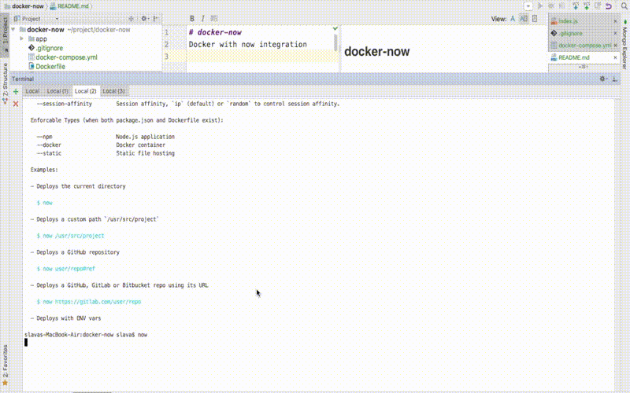

# docker-now
Docker and `now`

- https://www.npmjs.com/package/now
- https://zeit.co/
- https://zeit.co/now
- https://zeit.co/blog/now-dockerfile

```dockerfile
FROM node:7
LABEL name "hello-app"

ADD ./app /app
WORKDIR /app
RUN npm install

EXPOSE 3000
ENTRYPOINT node index.js
```



[YouTube](https://youtu.be/mm48uHXyptg)